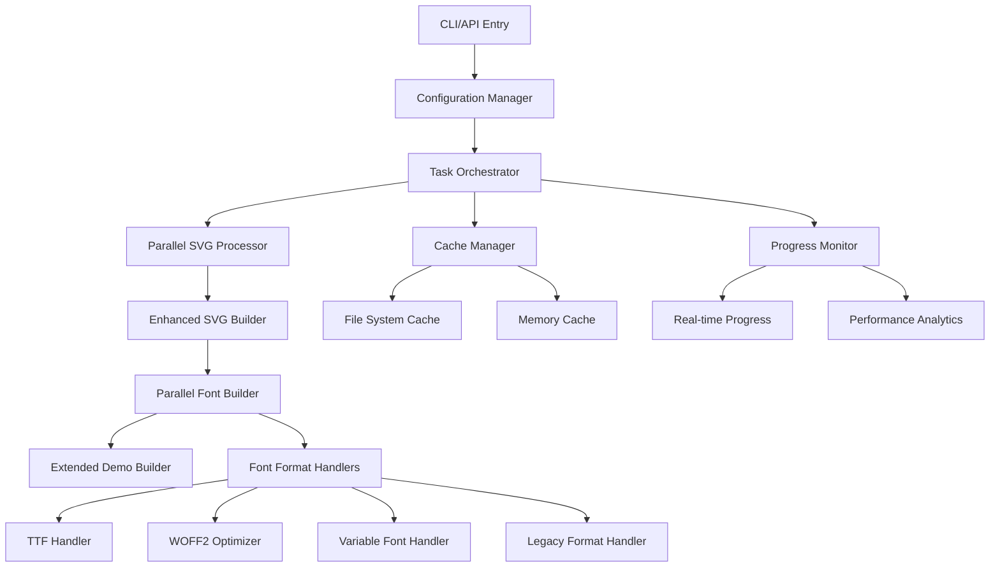

# Design Document

## Overview

This design document outlines the architecture for enhancing the svgs2fonts tool capabilities and improving its performance. The current implementation processes SVG files sequentially and lacks advanced configuration options, caching mechanisms, and performance monitoring. The enhanced version will introduce parallel processing, advanced configuration options, caching, progress monitoring, and extended format support while maintaining backward compatibility.

## Architecture

### Current Architecture Analysis

The existing system follows a sequential builder pattern:

1. **SVGBuilder**: Converts SVG files to SVG font
2. **FontsBuilder**: Converts SVG font to TTF, then to EOT/WOFF/WOFF2
3. **DemoBuilder**: Generates HTML/CSS demo files

### Enhanced Architecture



## Components and Interfaces

### 1. Configuration Manager

**Purpose**: Handle extended configuration options and validation

```typescript
interface EnhancedOptions extends InitOptionsParams {
  // Performance options
  maxConcurrency?: number;
  enableCache?: boolean;
  cacheDir?: string;
  streamProcessing?: boolean;

  // Advanced font options
  fontFormats?: FontFormat[];
  fontMetrics?: FontMetrics;
  subsetting?: SubsettingOptions;
  optimization?: OptimizationOptions;

  // Batch processing
  batchMode?: boolean;
  inputDirectories?: string[];
  outputPattern?: string;

  // Monitoring
  verbose?: boolean;
  progressCallback?: ProgressCallback;
  performanceAnalysis?: boolean;

  // Template customization
  customTemplates?: TemplateOptions;
}

interface FontMetrics {
  baseline?: number;
  ascent?: number;
  descent?: number;
}

interface SubsettingOptions {
  includeGlyphs?: string[];
  unicodeRanges?: UnicodeRange[];
}
```

### 2. Task Orchestrator

**Purpose**: Coordinate parallel processing and resource management

```typescript
interface TaskOrchestrator {
  planExecution(options: EnhancedOptions): ExecutionPlan;
  executeParallel(plan: ExecutionPlan): Promise<ExecutionResult>;
  handleErrors(errors: ProcessingError[]): void;
}

interface ExecutionPlan {
  svgProcessingTasks: SVGTask[];
  fontGenerationTasks: FontTask[];
  demoGenerationTasks: DemoTask[];
  dependencies: TaskDependency[];
}
```

### 3. Cache Manager

**Purpose**: Implement intelligent caching to avoid reprocessing

```typescript
interface CacheManager {
  getCachedResult(key: string): Promise<CacheEntry | null>;
  setCachedResult(key: string, data: any, metadata: CacheMetadata): Promise<void>;
  invalidateCache(pattern: string): Promise<void>;
  generateCacheKey(input: ProcessingInput): string;
}

interface CacheEntry {
  data: any;
  metadata: CacheMetadata;
  timestamp: number;
  hash: string;
}
```

### 4. Progress Monitor

**Purpose**: Provide real-time progress tracking and performance analytics

```typescript
interface ProgressMonitor {
  startTracking(totalTasks: number): void;
  updateProgress(completed: number, current?: string): void;
  recordTiming(phase: string, duration: number): void;
  generateReport(): PerformanceReport;
}

interface PerformanceReport {
  totalTime: number;
  phaseBreakdown: PhaseTimings;
  fileStats: FileStatistics;
  memoryUsage: MemoryStats;
}
```

### 5. Enhanced Builders

#### Parallel SVG Processor

```typescript
class ParallelSVGProcessor extends SVGBuilder {
  private concurrencyLimit: number;
  private cacheManager: CacheManager;

  async processInBatches(svgPaths: string[]): Promise<ProcessingResult[]>;
  async processSingleSVG(path: string): Promise<SVGResult>;
}
```

#### Parallel Font Builder

```typescript
class ParallelFontBuilder extends FontsBuilder {
  async generateAllFormats(): Promise<FontGenerationResult>;
  async optimizeWOFF2(buffer: Buffer): Promise<Buffer>;
  async generateVariableFont(options: VariableFontOptions): Promise<Buffer>;
}
```

## Data Models

### Processing Context

```typescript
interface ProcessingContext {
  options: EnhancedOptions;
  inputFiles: FileInfo[];
  outputPaths: OutputPathMap;
  cache: CacheManager;
  monitor: ProgressMonitor;
  errors: ProcessingError[];
}

interface FileInfo {
  path: string;
  name: string;
  hash: string;
  size: number;
  lastModified: Date;
}
```

### Font Generation Results

```typescript
interface FontGenerationResult {
  formats: Map<FontFormat, Buffer>;
  metadata: FontMetadata;
  optimizationStats: OptimizationStats;
  errors: FontError[];
}

interface FontMetadata {
  glyphCount: number;
  unicodeRanges: UnicodeRange[];
  fileSize: Map<FontFormat, number>;
  compressionRatio: Map<FontFormat, number>;
}
```

## Error Handling

### Error Classification

1. **Input Errors**: Invalid SVG files, missing directories
2. **Processing Errors**: Font generation failures, optimization errors
3. **Output Errors**: File system write failures, permission issues
4. **Performance Errors**: Memory exhaustion, timeout errors

### Error Recovery Strategy

```typescript
interface ErrorHandler {
  classifyError(error: Error): ErrorType;
  shouldRetry(error: ProcessingError): boolean;
  handleRecoverableError(error: ProcessingError): Promise<void>;
  reportFatalError(error: ProcessingError): void;
}

enum ErrorRecoveryAction {
  RETRY,
  SKIP,
  FALLBACK,
  ABORT,
}
```

### Graceful Degradation

- Continue processing remaining files when individual files fail
- Fallback to basic formats when advanced optimization fails
- Provide partial results with detailed error reporting

## Testing Strategy

### Unit Testing

- **Configuration Manager**: Validate option parsing and validation
- **Cache Manager**: Test cache hit/miss scenarios and invalidation
- **Parallel Processors**: Test concurrency limits and error handling
- **Font Builders**: Test format generation and optimization

### Integration Testing

- **End-to-End Workflows**: Test complete processing pipelines
- **Performance Testing**: Validate performance improvements
- **Error Scenarios**: Test error handling and recovery
- **Cache Behavior**: Test caching across multiple runs

### Performance Testing

```typescript
interface PerformanceTest {
  name: string;
  inputSize: number; // Number of SVG files
  expectedImprovement: number; // Percentage improvement
  memoryLimit: number; // Maximum memory usage
  timeLimit: number; // Maximum processing time
}

const performanceTests: PerformanceTest[] = [
  {
    name: 'Large SVG Set',
    inputSize: 500,
    expectedImprovement: 50,
    memoryLimit: 512 * 1024 * 1024, // 512MB
    timeLimit: 30000, // 30 seconds
  },
];
```

### Test Data Management

- **Small Dataset**: 10-20 SVG files for basic functionality
- **Medium Dataset**: 100-200 SVG files for performance testing
- **Large Dataset**: 500+ SVG files for stress testing
- **Edge Cases**: Malformed SVGs, empty files, special characters

## Performance Optimizations

### Parallel Processing

- Process SVG files concurrently with configurable limits
- Generate font formats in parallel instead of sequentially
- Use worker threads for CPU-intensive operations

### Caching Strategy

- **File-level caching**: Cache processed SVG results based on file hash
- **Font-level caching**: Cache generated font buffers
- **Template caching**: Cache compiled demo templates

### Memory Management

- **Streaming processing**: Process large datasets without loading all into memory
- **Buffer pooling**: Reuse buffers for font generation
- **Garbage collection optimization**: Clear references promptly

### I/O Optimization

- **Batch file operations**: Group file system operations
- **Async I/O**: Use non-blocking file operations
- **Compression**: Compress cached data to reduce storage

## Backward Compatibility

### API Compatibility

- Maintain existing `init()` function signature
- Support all current configuration options
- Preserve existing output file formats and naming

### Migration Strategy

- Gradual feature rollout with feature flags
- Comprehensive testing with existing projects
- Clear documentation for new features

### Deprecation Policy

- Mark deprecated features with clear warnings
- Provide migration guides for removed features
- Maintain deprecated features for at least one major version
